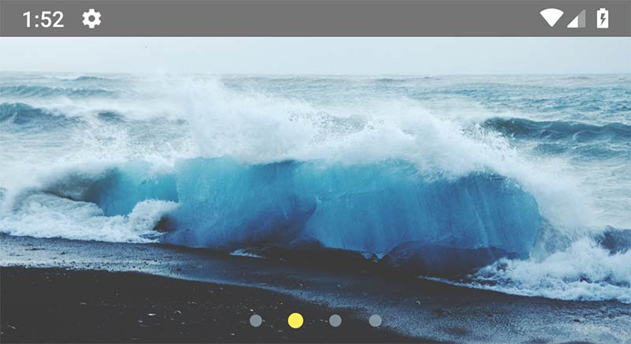
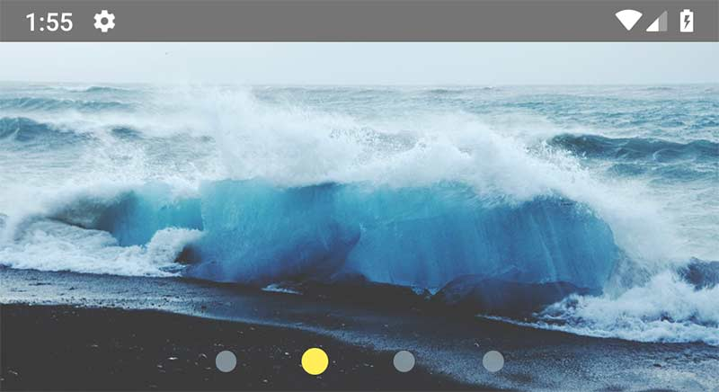
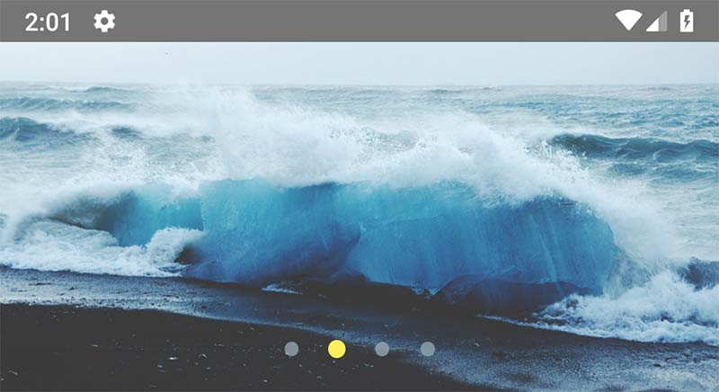
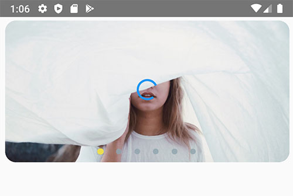

# react-native-image-slider-box

[](https://www.npmjs.com/package/react-native-image-slider-box)  


> `Announce`: All Pull-Requests have been applied. 
>> CI/CD has been integrated to update the package automatically.

[How to send a pull-request for this lib??? > Please Read this section before send a pull request
](#how-to-send-a-pull-request)

---


## Install

1. First, install our library | use below npm script

   > npm i react-native-image-slider-box

   > yarn add react-native-image-slider-box

2. (Optional) : if you want to use third-party image library such as FastImage
   > npm i react-native-fast-image

   > yarn add react-native-fast-image

Well-done.

## Usage :

### list of available props for customization SliderBox:

| Props                        | Value Type                            | Description                                                                                                                                             |
| ---------------------------- | ------------------------------------- | ------------------------------------------------------------------------------------------------------------------------------------------------------- |
| `ImageComponent`             | Image component, default as `Image`   | default value is React-native Image, if you use third-party library like FastImage use this property                                                    |
| images                       | Array of image path(or url) as string | Set array of images path- these paths can contain `http url link` or `local images path` using `require('./pathOfImage')`                                                                    |
| onCurrentImagePressed        | handler function callback             | callback for get pressed image index (index start from 0)                                                                                               |
| currentImageEmitter          | handler function callback             | callback for get current image index (index start from 0)                                                                                               |
| disableOnPress               | boolean               |               if present, then onCurrentImagePressed will be disabled                            |
| activeOpacity                | number                             | default value = 0.85, Determines the opacity when touch is active. The value should be between 0 and 1                                                                                           
| sliderBoxHeight              | int value                             | default value = 200, you can change height of image slider box                                                                                          |
| parentWidth                  | int                                   | default = screen.width ; in advance mode, if parent is smaller, you can change it. best practice is use onLayout handler in parent component or screen. |
| dotColor                     | color string code                     | change color of paging dot                                                                                                                              |
| inactiveDotColor             | color string code                     | change color of inactive paging dot                                                                                                                     |
| dotStyle                     | style object                          | default style is : {width: 10,height: 10,borderRadius: 5,marginHorizontal: 0,padding: 0,margin: 0,} change style of paging dots if you want            |
| paginationBoxVerticalPadding | int value                             | default = 10 ; change the height of paging dots from bottom of Slider-Box                                                                               |
| autoplay                     | bool value                            | default = false                                                                               |
| circleLoop                   | boolean - attribute                   | if set, when user swiped to last image circularly return to the first image again.                                                                      |
| paginationBoxStyle           | object,default values use lib style   | customize pagination box                                                                                                                                |
| dotStyle                     | object,default use lib style          | customize dot styles                                                                                                                                    |
| resizeMethod                 | string                                | default is `resize`                                                                                                                                     |
| resizeMode                   | string                                | default is `cover`                                                                                                                                      |
| ImageComponentStyle          | object                                | {} style object for ImageComponent   |
  | imageLoadingColor            | string                                | default is `#E91E63` , image loading indicator color       |
| ImageLoader            | React component, default as `ActivityIndicator`                                | default value is React-native ActivityIndicator.
| firstItem            | number                                | default is 0 , index of image to display when slider box loads       |
| LoaderComponent            | component                                | default is ActivityIndicator , you can pass any component to show as Loader       |

### 1- add below import in your code :

```js
import { SliderBox } from "react-native-image-slider-box";
```

### 2- Define your image array source, for below examples i create array in state.

```js
export default class App extends Component {
  constructor(props) {
    super(props);
    this.state = {
      images: [
        "https://source.unsplash.com/1024x768/?nature",
        "https://source.unsplash.com/1024x768/?water",
        "https://source.unsplash.com/1024x768/?girl",
        "https://source.unsplash.com/1024x768/?tree", // Network image
        require('./assets/images/girl.jpg'),          // Local image
      ]
    };
  }
  // other component code ...
}
```

### 3- Use SliderBox such as these below examples :

### Example 1 : SliderBox without and handler or customization

```js
<SliderBox images={this.state.images} />
```

### Example 2 : SliderBox with image press handler and currentImageEmitter


```js
<SliderBox
  images={this.state.images}
  onCurrentImagePressed={index => console.warn(`image ${index} pressed`)}
  currentImageEmitter={index => console.warn(`current pos is: ${index}`)}
/>
```

### Example 3 : SliderBox with image press handler and change slider height (default is 200)


```js
<SliderBox
  images={this.state.images}
  sliderBoxHeight={400}
  onCurrentImagePressed={index => console.warn(`image ${index} pressed`)}
/>
```

### Example 4 : SliderBox with custom width from parent. use `onLayout` function by calling it from `root View` of component.

```js
onLayout = e => {
  this.setState({
    width: e.nativeEvent.layout.width
  });
};
```

```js
render() {
    return (
        <View style={styles.container} onLayout={this.onLayout}>
            <SliderBox
                images={this.state.images}
                sliderBoxHeight={200}
                onCurrentImagePressed={index =>
                    console.warn(`image ${index} pressed`)
                }
                parentWidth={this.state.width}
            />
        </View>
    );
  }
```

### Example 5 : SliderBox with custom dots color



```js
<SliderBox
  images={this.state.images}
  sliderBoxHeight={200}
  onCurrentImagePressed={index => console.warn(`image ${index} pressed`)}
  dotColor="#FFEE58"
  inactiveDotColor="#90A4AE"
/>
```

### Example 6 : SliderBox with custom dot style



```js
<SliderBox
  images={this.state.images}
  sliderBoxHeight={200}
  onCurrentImagePressed={index => console.warn(`image ${index} pressed`)}
  dotColor="#FFEE58"
  inactiveDotColor="#90A4AE"
  dotStyle={{
    width: 15,
    height: 15,
    borderRadius: 15,
    marginHorizontal: 10,
    padding: 0,
    margin: 0
  }}
/>
```

### Example 7 : SliderBox with change paging box padding (Vertical height from bottom of SliderBox) + add `autoplay` and `circleLoop` attribute for jump to the first image after swipe the last one.



```js
<SliderBox
  images={this.state.images}
  sliderBoxHeight={200}
  onCurrentImagePressed={index => console.warn(`image ${index} pressed`)}
  dotColor="#FFEE58"
  inactiveDotColor="#90A4AE"
  paginationBoxVerticalPadding={20}
  autoplay
  circleLoop
/>
```

<hr/>

### Example 8 : use `Custom Image Component`, customize pagination, image `modes` and dotStyles:



```js
<SliderBox
  ImageComponent={FastImage}
  images={this.state.images}
  sliderBoxHeight={200}
  onCurrentImagePressed={index => console.warn(`image ${index} pressed`)}
  dotColor="#FFEE58"
  inactiveDotColor="#90A4AE"
  paginationBoxVerticalPadding={20}
  autoplay
  circleLoop
  resizeMethod={'resize'}
  resizeMode={'cover'}
  paginationBoxStyle={{
    position: "absolute",
    bottom: 0,
    padding: 0,
    alignItems: "center",
    alignSelf: "center",
    justifyContent: "center",
    paddingVertical: 10
  }}
  dotStyle={{
    width: 10,
    height: 10,
    borderRadius: 5,
    marginHorizontal: 0,
    padding: 0,
    margin: 0,
    backgroundColor: "rgba(128, 128, 128, 0.92)"
  }}
  ImageComponentStyle={{borderRadius: 15, width: '97%', marginTop: 5}}
  imageLoadingColor="#2196F3"
/>
```


### Example 9 : SliderBox with activeOpacity:


```js
<SliderBox
  images={this.state.images}
  sliderBoxHeight={200}
  activeOpacity={0.5}
/>
```

## Full-Component(Screen) Example:

```js
import React, { Component } from "react";
import { StyleSheet, Text, View } from "react-native";

import { SliderBox } from "react-native-image-slider-box";

export default class App extends Component {
  constructor(props) {
    super(props);
    this.state = {
      images: [
        "https://source.unsplash.com/1024x768/?nature",
        "https://source.unsplash.com/1024x768/?water",
        "https://source.unsplash.com/1024x768/?girl",
        "https://source.unsplash.com/1024x768/?tree",
        require('./assets/images/girl.jpg'),
      ]
    };
  }

  render() {
    return (
      <View style={styles.container}>
        <SliderBox
          images={this.state.images}
          onCurrentImagePressed={index =>
            console.warn(`image ${index} pressed`)
          }
        />
      </View>
    );
  }
}

const styles = StyleSheet.create({
  container: {
    flex: 1
  }
});
```

# Contribute And Update the Library

Please Edit and use `dist/SliderBox.js` file as src component file.
## How to send a pull-request
To send a pull-request please follow these rules for naming the commit message. Based on the commit messages, increment the version from the lastest release.

- If the string "`BREAKING CHANGE`" is found anywhere in any of the commit messages or descriptions the major version will be incremented.
- If a commit message begins with the string "`feat`" then the minor version will be increased. b"feat: new API" and "feature: new API".
- All other changes will increment the `patch version`.

### ! `Important: Please update the README.MD file corresponding with your added features.`
## Please subscribe and contribute with me to develop this lib

---

## Notice:

This library use `react-native-snap-carousel` and make easier way to create image slider box with full customization ability.

See original Library [https://github.com/archriss/react-native-snap-carousel](https://github.com/archriss/react-native-snap-carousel)

we dont edit or modify original library, we just use it with some additional style. (BSD 3 License)

---
### License MIT